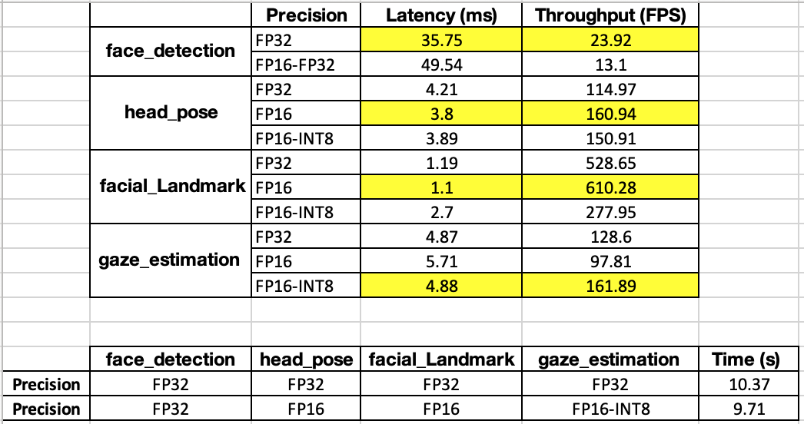

# Computer Pointer Controller

In this project, I use a gaze detection model to control the mouse pointer of my computer. I use the Gaze Estimation model to estimate the gaze of the user's eyes and change the mouse pointer position accordingly. This project will require running multiple models in the same machine and coordinating the flow of data between those models.

## Project Set Up and Installation
The models used in this project are:

- [Face Detection](https://docs.openvinotoolkit.org/latest/_models_intel_face_detection_adas_binary_0001_description_face_detection_adas_binary_0001.html)
- [Head Pose Estimation](https://docs.openvinotoolkit.org/latest/_models_intel_head_pose_estimation_adas_0001_description_head_pose_estimation_adas_0001.html)
- [Facial Landmark Detection](https://docs.openvinotoolkit.org/latest/_models_intel_landmarks_regression_retail_0009_description_landmarks_regression_retail_0009.html)
- [Gaze Estimation Model](https://docs.openvinotoolkit.org/latest/_models_intel_gaze_estimation_adas_0002_description_gaze_estimation_adas_0002.html)

The procedure for seting up your environment includes:
- Download and install **OpenVino toolkit** using the instructions provided [here](https://github.com/udacity/nd131-openvino-fundamentals-project-starter/blob/master/mac-setup.md).
- Download and install the DL Workbench from [here](https://docs.openvinotoolkit.org/latest/_docs_Workbench_DG_Install_Workbench.html). In short, you will need to:
	- For Linux and Windows you can find the docker command [here](https://docs.openvinotoolkit.org/latest/_docs_Workbench_DG_Install_from_Docker_Hub.html#install_dl_workbench_from_docker_hub_on_windows_os).
	- For macOS, the Docker command is:
	```
	docker run -p 127.0.0.1:5665:5665 --name workbench -e PROXY_HOST_ADDRESS=0.0.0.0 -e PORT=5665 -it openvino/workbench:latest
	```
- Download VTune Amplifier from [here](https://software.intel.com/en-us/vtune/choose-download#standalone) and you can get detailed instructions about how to install and run it from [here](https://software.intel.com/en-us/get-started-with-vtune). 

This code follows the following directory structure:

	.
	├── LICENSE 
	├── README.md                      <- The top-level README for developers using this project.
	├── bin
	│   ├── demo.mp4                   <- Input video to test the code.
	│     
	│     
	├── requirements.txt               <- Package dependencies required to be installed.
	├── src                            <- Source code for use in this project.
        ├── face_detection.py                  <- Face detection model
        ├── head_pose_estimation.py            <- Head pose estimation model
        ├── facial_landmarks_detection.py      <- Facial landmarks detection model
        ├── gaze_estimation.py                 <- Gaze estimation model
        │
        ├── input_feeder.py                    <- Script to handle the input images
        ├── mouse_controller.py                <- Script to move the mouse accoording to estimated gaze direction
        │
        └── main.py                            <- The main script coordinating flow of data from the input, and then amongst different models and finally to the mouse controller.
    
        
## Demo
*TODO:* Explain how to run a basic demo of your model.

## Model Pipeline:
The project involves interaction multiple models and here is the model pipeline works:
- Face detection model receives an image, run the inference, detects the face, crop and output the detected face.
- Head pose estimation model receives the dtected face as input and output the head pose angles (yaw, pitch, roll).
- Landmark face detection model receives the dtected face as input and output the cropped left and right eye. 
- Gaze estimation model receives the cropped left and right eye and the head pose angles as input and output the gaze_vector.
- Finally the x and y coordinates of the gaze vector will be provided to the mouse controller and the mouse pointer will be moved accordingly. 

## Benchmarks
The benchamrk results are shown in the following tables:


## Results
*TODO:* Discuss the benchmark results and explain why you are getting the results you are getting. For instance, explain why there is difference in inference time for FP32, FP16 and INT8 models.

## Stand Out Suggestions
This is where you can provide information about the stand out suggestions that you have attempted.

### Async Inference
If you have used Async Inference in your code, benchmark the results and explain its effects on power and performance of your project.

### Edge Cases
There will be certain situations that will break your inference flow. For instance, lighting changes or multiple people in the frame. Explain some of the edge cases you encountered in your project and how you solved them to make your project more robust.
